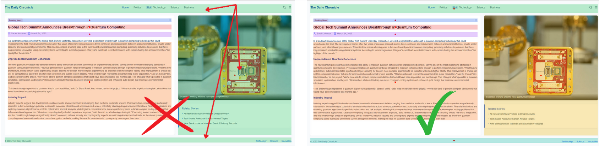
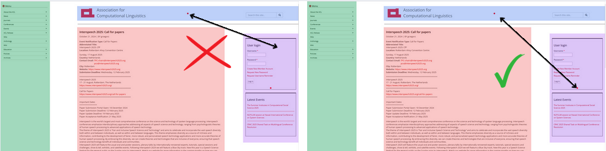
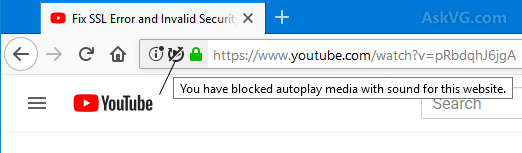
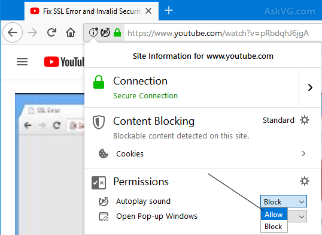

# Demonstration video

[Link to the video](https://sdrive.cnrs.fr/s/sPJmor4KHaf7N8Z "Link to the demonstration video")

# SystemX Usage Guide

#### Pre-requisites
| Requirement                        | Details                                                                 |
|------------------------------------|-------------------------------------------------------------------------|
| Browser                            | Firefox Desktop (version 48 or newer)                |
| Supported Operating Systems        | Windows 10/11, macOS, and Linux                           |
| Internet Connection                | Stable connection required                                    |

#### Installation guide
1. Download the extension from the following link: [https://tinyurl.com/mryefpb8](https://tinyurl.com/mryefpb8)
2. Type `about:addons` in Firefox's address bar and hit Enter.
3. Click the gear icon ⚙️ at the top right of the Add-ons page.
4. Select "Install Add-on From File…".
5. Browse the .xpi file, select it, and click Open.
6. Firefox will prompt you to confirm the installation — click “Add”.
7. [Optional] Pin the extension on the taskbar

#### Usage guide
- Navigate to any of the suggested websites (You may try other websites, but due to computational constraints and the size of the desired page, they might not run properly):
  - [ASSETS 2025 website](https://assets25.sigaccess.org/)
  - [Mock News article](https://article-systemx.netlify.app/) (Best with 7 zones)
  - [Mock News Website](https://news-systemx.netlify.app/)
- Click on the extension, and verify the server status to be "available". If not, try again at a later time.
- [Optional] Configure the number of zones, keywords, and ngram size.
- Click on "Start" and wait. This might take up to a minute or two.
- Once the loading finishes, configure your skimming and scanning modes:
  - Skimming: Starts right after you turn on vocalization, gives you an overview of the webpage.
  - Scanning: Allows you to navigate through the webpage and get vocal feedback of
- Use the Keyboard to enable the vocalization: `Ctrl + Alt + J` for Windows, `Cmd + ⌥ + J` for Mac.
- Press `Ctrl` (`Cmd` for Mac) and Left Click to enter a zone, and the same with Right Click to exit.

#### Important Notes
- We intentionally limit the zones tree to a depth of 1 due to computational constraints associated with publicly sharing our platform with multiple users.
- For now, we only support vocalizing **English pages**. Other language will still be vocalized, but with an English pronounciation.
- Make sure to choosen a sufficient number of zones (5-8 usually works best) and that they zones are **distinct**. If the zones aren't distinct, reload the page and re-run the pipeline with a higher number of zones.

- For scanning strategies "Target Only", "Origin-Target" and "Proximity", the distance and direction are calculated depending on the cursor position and the zone's center, not the zone's edges. So when you navigate, particularly for "Origin-Target" and "Target-only", make sure you're within a 30° movement angle of the zone's center.

#### Common issues
##### What if I don't hear any sound?

1. Check the URL bar in case Firefox blocked the audio output.

2. Restart sound: `Ctrl + Alt + J` or `Cmd + ⌥ + J` twice.

If the vocalization sitll doesn't work, it might mean that the webpage is not supported due to technical limitations (Content Security Policy of the specific page.).
